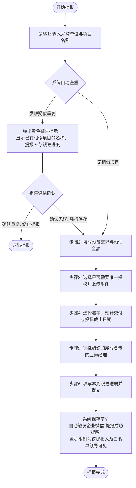
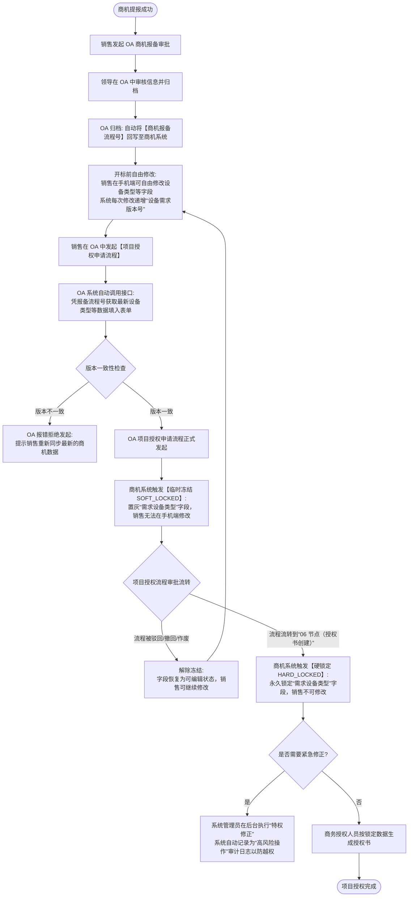

# 商机管理系统 (BOMS) 业务需求与核心流程说明书 (BRD)

本篇文档专为**业务人员（销售、销售经理、领导及审批人）**编写，旨在用通俗易懂的语言解释系统的核心运作逻辑、权限边界、企微提醒以及与 OA 系统（商机报备、项目授权申请）的同步锁定机制。

---

## 1. 业务流程图 (一目了然)

### 1.1 流程图一：销售提报商机与智能查重流程
销售人员在手机端/PC端提报商机时的填写路径与防重复规则：

---

### 1.2 流程图二：OA 审批与项目授权设备需求锁定生命周期
商机提报后，与内部 OA 审批流（商机报备、项目授权申请）进行数据同步及关键字段冻结锁定的生命周期：

---

## 2. 销售日常操作与权限划分 (能做什么？)

系统利用**企业微信身份 (wecomUserId)** 自动识别你是谁，并划分了清晰的查看和编辑边界，避免了“越权查看”或“数据混乱”。

### 2.1 销售员 (普通用户)
* **能看什么**：只能看到自己创建、提报或被指派负责的商机列表与看板。
* **能改什么**：可以提报新商机，可以编辑自己名下的商机字段、上传/删除附件、记录跟进进展。
* **限制**：不能查看或修改其他销售提报的任何项目；若商机被 OA 流程锁定，则无法自行修改设备类型。

### 2.2 团队负责人/领导 (授权用户)
* **能看什么**：可以查看自己名下的项目，以及管理员为您配置的**“白名单下属销售员”**的所有项目。
* **能改什么**：可以编辑自己和白名单下属的所有商机信息，查看他们项目的字段修改历史。
* **限制**：不能自己维护/修改自己的白名单范围，需向管理员申请。

### 2.3 系统管理员 (Admin)
* **能看什么**：可见全库所有商机，包含 Excel 导入的未归属历史项目。
* **能改什么**：拥有全量编辑特权；可管理配置白名单、同步企业微信通讯录、特殊修正已被 OA 锁定的字段（生成高审计日志）。

---

## 3. 企业微信智能跟进提醒规则 (如何督促跟进？)

为保障项目按时推进，系统每天早上 **9:00** 会自动扫描数据，通过企业微信自建应用向对应的销售负责人直发**“智能跟进通知”**。

目前支持 7 大提醒场景：
1. **提报成功通知**：新建商机保存时，瞬间向提报人发送确认通知。
2. **投标截止提醒**：在投标截止日前 $N$ 天（默认 3 天），提醒销售抓紧跟进。
3. **预计交付提醒**：在预计设备交付日期前 $N$ 天（默认 3 天），提醒销售确认交付细节。
4. **周更新跟进提醒**：若商机处于跟进状态，且超过 $W$ 天（默认 7 天）没有进行过任何资料修改或日志记录，提醒销售更新进展。
5. **授权书缺失提醒**：当项目被勾选了“需唯一授权”，但授权品类为空或没有上传授权凭证文件时，提醒销售补齐材料。
6. **商机报备催办**：投标截止临近但系统未勾选“已报备成功”时，催促销售发起 OA 报备。
7. **中标结果录入**：已过投标截止日期，但项目的中标状态仍为空时，催促销售录入中标/未中标结果。

---

## 4. OA 关联与需求锁定机制 (如何防止数据篡改？)

为保证最终项目授权的需求设备与审批归档的需求完全一致，系统引入了**“临时冻结”** and **“硬锁定”**机制：

* **未锁定 (UNLOCKED)**：项目授权申请流程尚未发起时。销售可以随意在手机端修改“需求设备类型”。每次修改，系统内部会自动将 `设备需求版本号` + 1（初始为 1）。
* **临时冻结 (SOFT_LOCKED)**：销售在 OA 发起“项目授权申请流程”的瞬间，商机系统校验版本一致后，会将该商机的设备类型锁定。此时销售在手机端无法修改。
  * **解冻**：如果 OA 项目授权流程被驳回、销售撤回或作废，商机系统接收回调后会自动解冻，销售可以重新修改。
* **硬锁定 (HARD_LOCKED)**：当 OA 项目授权流程流转到关键的 **“06 节点（授权书创建审批）”** 后，说明审批已经进入商务实质阶段。商机系统接收回调，将字段变更为“硬锁定”。
  * 此时销售即使流程被驳回也无法再修改。若确因特殊原因必须修改，必须提交申请由管理员在系统后台进行“特权修正”，修改行为会被写入高风险操作记录备查。

---

## 5. 常见业务问答 (FAQ)

**Q：为什么我在手机端“我的商机”里找不到我提报的项目？**
> **A**：请确认项目是否被其他销售修改了负责人（Owner）。如果项目的负责人或提报人都不是你，且你不是管理员，该项目将因为数据隔离自动对你隐藏。

**Q：为什么系统不让我发起项目授权申请？OA 提示“版本号不一致”是什么意思？**
> **A**：说明在你发起项目授权申请之前，又有其他有权限的人（如管理员或白名单领导）在商机系统中修改了你的设备参数，导致商机系统里的数据版本比你 OA 表单里暂存的数据更新。你需要重新点击 OA 的“同步”按钮重新拉取最新参数再发起。

**Q：唯一的“主数据源”是什么意思？以哪个为准？**
> **A**：意思是所有设备类型的修改都必须在商机系统中进行。OA 里归档的文件仅作为历史快照，最终项目授权、发货和统计都以商机系统当前显示的最新数据为准。

