# OA商机报备与投标文件制作流程图

日期：2026-05-26

来源文档：

- `docs/requirements/2026-05-25-OA商机报备与投标文件制作同步需求.md`
- 第 15 节：流程图节点建议
- 第 16 节：已确认问题

## 1. 流程图口径

本流程图用于表达：

- 手机端商机提报后发起 OA 商机报备。
- OA 商机报备归档后回写商机报备流程号。
- 业务在投标文件制作流程发起前，可以修改商机系统中的最新信息。
- OA 投标文件制作流程发起前，通过商机报备流程号调用商机系统预填接口。
- 投标文件制作流程发起后，临时冻结 `需求设备类型` 字段。
- 到授权书创建审批 06 节点后，硬锁定 `需求设备类型` 字段。
- OA 流程撤回、驳回或作废时，解除临时冻结。

## 2. Mermaid 流程图

```mermaid
flowchart LR
  subgraph U["业务用户"]
    U1["1. 手机端填写商机"]
    U2["3. 发起 OA 商机报备"]
    U3["8. 开标前修改需求设备类型 / 版本追踪字段"]
    U4["10. 发起投标文件制作"]
  end

  subgraph S["商机系统"]
    S1["2. 保存商机主数据\n生成 opportunityId"]
    S2["7. 保存商机报备流程号\nreportFlowNo"]
    S3["9. 更新最新主数据\n递增 deviceRequirementVersion"]
    S4["12. 返回最新商机报备信息\n含需求设备类型与版本号"]
    S5["15. 设置临时冻结\nSOFT_LOCKED\n只冻结需求设备类型"]
    S6["18. 设置硬锁定\nHARD_LOCKED\n只锁定需求设备类型"]
  end

  subgraph O["OA 系统"]
    O1["4. 保存商机报备快照"]
    O2["6. 商机报备归档"]
    O3["11. 通过统一网关调用预填接口\n传入 reportFlowNo"]
    O4["13. 生成投标文件制作表单快照"]
    O5["14. 回调流程已发起\n携带版本号"]
    O6["16. 流转到授权书创建审批 06 节点"]
    O7["17. 回调 06 节点"]
  end

  subgraph L["领导审批人"]
    L1["5. 确认商机报备信息"]
  end

  subgraph P["标书制作人员"]
    P1["19. 按流程数据制作文件"]
  end

  U1 --> S1 --> U2 --> O1 --> L1 --> O2 --> S2
  S2 --> U3 --> S3 --> U4 --> O3 --> S4 --> O4 --> O5 --> S5 --> O6 --> O7 --> S6 --> P1

  O3 -. "异常：找不到 reportFlowNo" .-> E1["返回 404\n提示未找到商机报备流程"]
  O3 -. "异常：商机报备未归档" .-> E2["返回 409\n提示商机报备流程未归档"]
  O5 -. "异常：版本号不一致" .-> E3["拒绝冻结\n提示 OA 重新同步最新数据"]
  O5 -. "撤回 / 驳回 / 作废" .-> E4["解除 SOFT_LOCKED\n恢复需求设备类型可编辑"]
  S6 -. "特殊情况" .-> E5["管理员特殊修正\n无需单独 OA 审批\n必须记录高风险操作"]

  classDef user fill:#EAF3FF,stroke:#2F80ED,color:#12314D;
  classDef system fill:#EAF8F1,stroke:#219653,color:#12351F;
  classDef oa fill:#FFF7E6,stroke:#F2994A,color:#4A2B00;
  classDef leader fill:#F4ECFF,stroke:#9B51E0,color:#2D174A;
  classDef maker fill:#F2F2F2,stroke:#828282,color:#222222;
  classDef exception fill:#FFECEC,stroke:#EB5757,color:#4A1111;

  class U1,U2,U3,U4 user;
  class S1,S2,S3,S4,S5,S6 system;
  class O1,O2,O3,O4,O5,O6,O7 oa;
  class L1 leader;
  class P1 maker;
  class E1,E2,E3,E4,E5 exception;
```

## 3. Figma 绘制建议

画布建议：

- Frame 名称：`OA商机报备与投标文件制作同步流程`
- 画布尺寸：`1920 x 1080`
- 布局：5 条横向泳道
- 泳道顺序：业务用户、商机系统、OA 系统、领导审批人、标书制作人员
- 节点宽度：`220`
- 节点高度：`72`
- 节点圆角：`8`
- 主流程连线：实线箭头
- 异常流程连线：虚线箭头

颜色建议：

| 泳道 | 背景色 | 节点边框 |
|---|---|---|
| 业务用户 | `#EAF3FF` | `#2F80ED` |
| 商机系统 | `#EAF8F1` | `#219653` |
| OA 系统 | `#FFF7E6` | `#F2994A` |
| 领导审批人 | `#F4ECFF` | `#9B51E0` |
| 标书制作人员 | `#F2F2F2` | `#828282` |
| 异常分支 | `#FFECEC` | `#EB5757` |

## 4. Figma 节点清单

| 编号 | 泳道 | 节点文案 |
|---|---|---|
| 1 | 业务用户 | 手机端填写商机 |
| 2 | 商机系统 | 保存商机主数据，生成 `opportunityId` |
| 3 | 业务用户 | 发起 OA 商机报备 |
| 4 | OA 系统 | 保存商机报备快照 |
| 5 | 领导审批人 | 确认商机报备信息 |
| 6 | OA 系统 | 商机报备归档 |
| 7 | 商机系统 | 保存商机报备流程号 `reportFlowNo` |
| 8 | 业务用户 | 开标前修改需求设备类型 / 版本追踪字段 |
| 9 | 商机系统 | 更新最新主数据，递增 `deviceRequirementVersion` |
| 10 | 业务用户 | 发起投标文件制作 |
| 11 | OA 系统 | 通过统一网关调用预填接口，传入 `reportFlowNo` |
| 12 | 商机系统 | 返回最新商机报备信息，含需求设备类型与版本号 |
| 13 | OA 系统 | 生成投标文件制作表单快照 |
| 14 | OA 系统 | 回调流程已发起，携带版本号 |
| 15 | 商机系统 | 设置临时冻结 `SOFT_LOCKED`，只冻结需求设备类型 |
| 16 | OA 系统 | 流转到授权书创建审批 06 节点 |
| 17 | OA 系统 | 回调 06 节点 |
| 18 | 商机系统 | 设置硬锁定 `HARD_LOCKED`，只锁定需求设备类型 |
| 19 | 标书制作人员 | 按流程数据制作文件 |

## 5. 异常分支

| 分支 | 触发点 | 处理 |
|---|---|---|
| A1 | OA 调用预填接口时找不到 `reportFlowNo` | 返回 404，提示未找到商机报备流程 |
| A2 | 商机报备流程未归档 | 返回 409，提示商机报备流程未归档 |
| A3 | OA 回调流程已发起时版本号不一致 | 拒绝冻结，提示 OA 重新同步最新数据 |
| A4 | 投标文件流程撤回、驳回或作废 | 解除 `SOFT_LOCKED`，恢复需求设备类型可编辑 |
| A5 | 硬锁定后管理员特殊修正 | 不需要单独 OA 审批，但必须记录高风险操作 |
